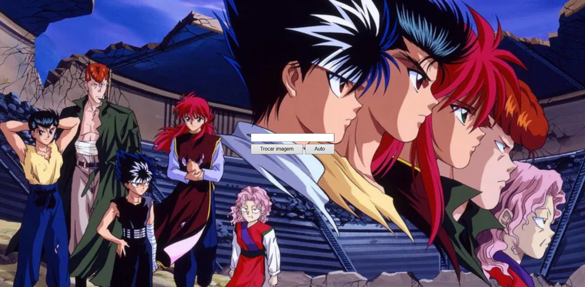

# IMAGENS JS

Projeto de página para testar habilidades de lógica com JavaScript no Front-End

## Como executar localmente?

1. Tenha o Visual Studio Code instalado em seu computador.

2. Instale a extensão "Five Server" se quiser acessar em mais dispositivos ou a "Live Server" para executar somente no computador.

3. No repositório do GitHub, faça um fork do projeto clicando no canto superior direito da página do repositório, no botão fork.

3. Faça um git clone do seu projeto forkado, abra-o dentro do Visual Studio Code apertando a tecla Ctrl + K + O.

4. Com o projeto aberto, clique no arquivo index.html e clique no botão inferior direito "Go live".

## Tecnologias

* HTML
* CSS
* JavaScript

## Autor

[Gabriel Lacerda](<https://www.linkedin.com/in/gabriellacerda1005/>)